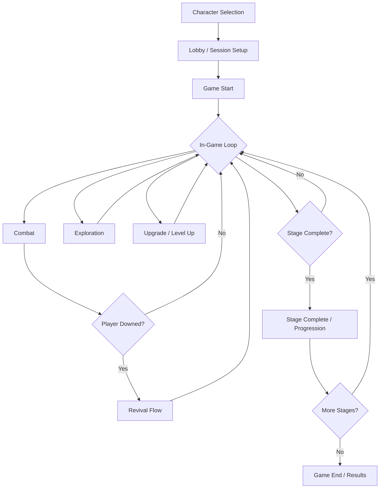

# Void Chaos

> ### ⚠️ IN DEVELOPMENT: Void Chaos is a Work in Progress
>
> **This project is an ambitious browser-based sci-fi horror roguelite with real-time action and online co-op.**
>
> <details>
> <summary>What is Void Chaos?</summary>
>
> Void Chaos is a multiplayer, top-down survival roguelite set in derelict sci-fi environments. Players must survive waves of mutating horrors, unlock new characters, and uncover the mysteries of the void. The game is built with modern web technologies (TypeScript, React, Next.js, ECS, Zustand) and is designed for seamless play directly in the browser.
>
> </details>

---

# Void Chaos

A browser-based, real-time multiplayer roguelite with procedurally generated levels, deep progression, and a focus on co-op survival horror.

**Status**

[](https://nextjs.org) [](https://reactjs.org) [](https://www.typescriptlang.org) [](https://tailwindcss.com)
[](https://zustand-demo.pmnd.rs/) [](https://jestjs.io)

---

## Table of Contents

- [Overview](#overview)
- [Key Features](#key-features)
- [Gameplay Loop](#gameplay-loop)
- [Technical Architecture](#technical-architecture)
- [Project Structure](#project-structure)
- [Getting Started](#getting-started)
- [Testing](#testing)
- [Development Roadmap](#development-roadmap)
- [Contributing](#contributing)
- [License](#license)
- [Acknowledgments](#acknowledgments)

---

## Overview

Void Chaos is a sci-fi horror roguelite for the browser, supporting up to 4-player online co-op. Players select unique survivors, each with signature weapons and abilities, and must survive escalating waves of enemies in procedurally generated, story-rich environments. The game is built on a custom ECS engine, leverages Next.js for the frontend, and uses Zustand for state management. Multiplayer is planned via WebSockets.

---

## Key Features

- **5 Unique Playable Characters**
  - Signature weapons, passive abilities, co-op auras, and narrative questlines
- **Procedural Environments**
  - Multiple stage types, hazards, and secret areas
- **Real-Time Action Combat**
  - Auto-firing weapons, responsive movement, and enemy waves
- **Deep Progression**
  - XP, weapon upgrades, passive modules, meta-progression, and achievements
- **Online Co-op**
  - Lobby system, matchmaking, real-time state sync (planned)
- **Narrative Integration**
  - Character backstories, environmental storytelling, and decision points
- **Modern Web Tech**
  - Next.js 15, React 19, TypeScript 5, Zustand, custom ECS, WebGL rendering
- **Accessibility & UX**
  - Mobile responsive, colorblind mode, scalable UI, and more

---

## Gameplay Loop

1. **Enter Game**: Select a character and join a session (solo or co-op)
2. **Survive Waves**: Fight off escalating enemy waves, collect XP, and upgrade
3. **Explore**: Discover logs, artifacts, and hidden areas for story and rewards
4. **Progress**: Unlock new abilities, weapons, and meta-progression
5. **Co-op Revival**: Revive fallen allies and coordinate for survival
6. **Complete Stages**: Advance narrative, unlock achievements, and climb leaderboards



---

## Technical Architecture

- **Frontend**: Next.js (App Router), React, Tailwind CSS
- **Game Engine**: Custom ECS (Entity Component System) in TypeScript
  - Core: Game loop, rendering (Canvas/WebGL), ECS, input, math utilities
  - Systems: AI, physics, collision, wave spawning, debug overlays
- **State Management**: Zustand (persistent, devtools-enabled)
- **Multiplayer**: WebSocket (planned, with state sync and prediction)
- **Testing**: Jest, React Testing Library, 80%+ coverage target
- **Dev Tools**: ESLint, Prettier, TypeScript strict mode

---

## Project Structure

```
void_chaos/
├── src/
│   ├── app/                # Next.js app (pages, layout, components)
│   ├── engine/             # Custom game engine
│   │   ├── Game.ts
│   │   ├── Canvas.ts
│   │   ├── Camera.ts
│   │   ├── Sprite.ts
│   │   ├── Layer.ts
│   │   ├── SpriteManager.ts
│   │   ├── README.md
│   │   ├── ecs/            # Entity Component System
│   │   │   ├── Entity.ts
│   │   │   ├── System.ts
│   │   │   ├── World.ts
│   │   │   ├── Serialization.ts
│   │   │   ├── README.md
│   │   │   ├── components/     # ECS components (Transform, Renderer, etc.)
│   │   │   ├── systems/        # ECS systems (AI, Render, Collision, etc.)
│   │   │   ├── factories/      # Entity factories (EnemyFactory, etc.)
│   │   │   ├── enemies/        # Enemy types and management
│   │   │   │   └── types/      # Individual enemy type definitions
│   │   │   ├── pathfinding/    # Grid/pathfinding utilities
│   │   │   └── ai/             # AI state machines and movement patterns
│   │   │       └── patterns/
│   │   │           ├── utils/
│   │   │           └── conditions/
│   │   ├── math/           # Math utilities
│   │   ├── input/          # Input system
│   │   └── core/           # Core utilities
│   ├── state/              # Zustand store and hooks
│   ├── types/              # TypeScript types
│   ├── config/             # Game and engine config
│   └── ws/                 # (Planned) WebSocket networking
├── public/                 # Static assets (sprites, icons)
├── scripts/                # Dev scripts (sprite generation, task management)
├── memory-bank/            # Planning, context, and design docs
├── package.json            # Project manifest
├── tsconfig.json           # TypeScript config
├── README.md               # This file
└── PRD.md                  # Product Requirements Document
```

This structure supports a modular, extensible, and testable game engine, with each subsystem (ECS, input, math, rendering) clearly separated and documented. Each major component and system is covered by tests and has its own README for deeper dives.

---

## Getting Started

### Prerequisites

- Node.js 18+
- (Optional) Bun, Yarn, or PNPM for alternative package managers

### Installation

```bash
# Clone the repo
$ git clone https://github.com/yourusername/void_chaos.git
$ cd void_chaos

# Install dependencies
$ npm install
# or
$ yarn install
# or
$ pnpm install
# or
$ bun install
```

### Running the Game

```bash
# Start the development server
$ npm run dev
# or
$ yarn dev
# or
$ pnpm dev
# or
$ bun dev
```

Open [http://localhost:3000](http://localhost:3000) in your browser.

---

## Testing

- **Unit & Integration**: Jest, React Testing Library
- **Coverage**: 80%+ required (see `jest.config.ts`)
- **Test Files**: `.test.ts`, `.test.tsx` colocated with source

```bash
# Run all tests
$ npm run test
# Watch mode
$ npm run test:watch
# Coverage report
$ npm run test:coverage
```

---

## Development Roadmap

- [x] Core ECS engine (game loop, rendering, input)
- [x] Basic player/enemy implementation
- [x] Procedural level generation (WIP)
- [x] Weapon and upgrade system
- [x] Zustand state management
- [ ] Multiplayer networking (WebSocket, state sync)
- [ ] Narrative and progression systems
- [ ] Achievements, meta-progression, cosmetics
- [ ] Accessibility and mobile support
- [ ] Community/social features (guilds, leaderboards)
- [ ] Polish, optimization, and launch

See [PRD.md](./PRD.md) for full requirements and roadmap.

---

## Acknowledgments

- Inspiration: Vampire Survivors, Risk of Rain, Enter the Gungeon, Hades
- Thanks to the open source community and all contributors

---

_Made with ❤️ by the Strange Hour team_
