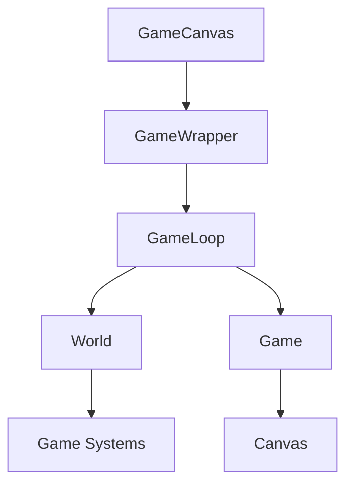

# Active Context

## Current Focus
- Implementing game loop system
- Integrating state with game loop
- Setting up core game components
- Creating basic game canvas

## Recent Changes

### Game Loop Integration
- Implemented singleton GameLoop class
- Integrated with existing ECS architecture
- Added fixed timestep (60Hz) for physics
- Added variable timestep for general updates
- Implemented proper cleanup and HMR support

### Current Architecture

### Active Systems
1. Game Loop
   - Fixed update at 60Hz
   - Variable update for general logic
   - Render callbacks for frame-specific operations

2. World Management
   - Entity lifecycle
   - System coordination
   - Component management

3. Rendering
   - Sprite management
   - Layer management
   - Debug visualization

4. Input
   - Keyboard controls
   - Mouse input (prepared)
   - Input buffering

### Current Game Flow
1. Initial Load
   - Canvas setup
   - Sprite preloading
   - System initialization

2. Game Start
   - World creation
   - Player spawning
   - Wave system activation

3. Runtime
   - Physics updates (60Hz)
   - Enemy spawning
   - Player input
   - Rendering

### Debug Features
- Toggle with F1 key
- Entity count display
- FPS counter
- Player stats
- Entity outlines
- Collision boundaries
- Debug grid

## Active Decisions

### Game Loop Architecture
- Using requestAnimationFrame for timing
- Separate update and render cycles
- State-driven game loop
- Component-based rendering
- Event-based input handling

### Implementation Priorities
1. Game loop system
2. Canvas rendering setup
3. State integration
4. Input handling
5. Basic game components

### Technical Considerations
- Frame timing and performance
- State update efficiency
- Canvas rendering optimization
- Component lifecycle management
- Event handling patterns

## Next Steps
1. Performance optimization
2. Additional game systems
3. Enhanced debug tools
4. Wave system refinement

### Immediate Tasks
1. Create game loop system
2. Set up canvas rendering
3. Implement basic movement
4. Add state integration
5. Create player component

### Upcoming Features
1. Enemy spawning system
2. Collision detection
3. Basic combat mechanics
4. Health and damage system
5. Score tracking

### Technical Debt
- None currently

## Current Challenges

### Technical Challenges
- Game loop performance optimization
- State update batching
- Canvas rendering efficiency
- Input latency management

### Implementation Challenges
- Game loop state synchronization
- Component update cycles
- Canvas layer management
- Event propagation

## Team Focus

### Current Sprint
- Game loop implementation
- Canvas rendering system
- Basic gameplay mechanics
- State integration

### Review Points
- Game loop architecture
- State update patterns
- Rendering approach
- Component structure

## Environment Setup

### Development Environment
- Node.js and npm versions
- IDE configuration
- Linting and formatting
- Test environment

### Required Tools
- Git
- Node.js
- npm
- VS Code
- Browser dev tools

## Documentation Status

### Completed
- Project brief
- Product context
- System patterns
- Technical context
- Active context
- State management docs

### In Progress
- Game loop documentation
- Component documentation
- Canvas system docs
- Input handling docs

## Current Blockers
- None currently

## Notes
- Focus on game loop performance
- Optimize state updates
- Keep rendering efficient
- Document game loop patterns 