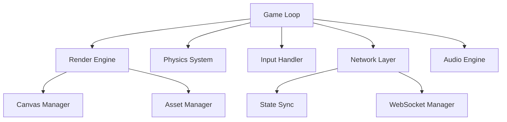
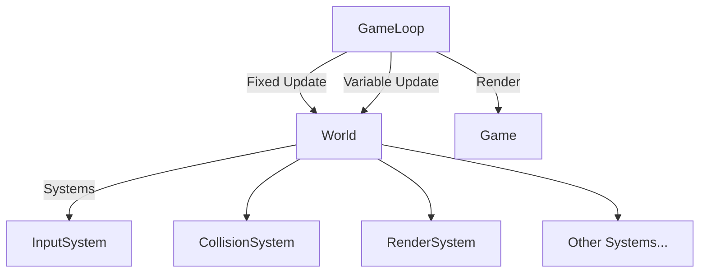

# System Patterns

## Architecture Overview

### Core Systems


## Directory Structure

### Current Structure
```
src/
  ├── README.md           # Source directory documentation
  ├── app/                # Next.js app directory
  │   ├── layout.tsx     # Root layout
  │   ├── page.tsx       # Home page
  │   └── globals.css    # Global styles
  ├── config/            # Configuration files
  │   ├── constants.ts   # Game constants
  │   └── settings.ts    # Game settings
  └── engine/            # Game engine core
      ├── core/          # Core engine systems
      ├── entities/      # Game entities
      └── utils/         # Engine utilities
```

### Planned Structure
```
src/
  ├── app/                # Next.js app directory
  │   ├── components/     # Shared React components
  │   ├── game/          # Game routes and pages
  │   └── styles/        # Component styles
  ├── config/            # Configuration
  │   ├── constants/     # Game constants
  │   └── settings/      # Game settings
  ├── engine/            # Game engine
  │   ├── core/          # Core systems
  │   │   ├── loop.ts    # Game loop
  │   │   ├── render.ts  # Render system
  │   │   └── input.ts   # Input system
  │   ├── entities/      # Game entities
  │   │   ├── player/    # Player entities
  │   │   └── enemies/   # Enemy entities
  │   ├── systems/       # Game systems
  │   │   ├── combat/    # Combat system
  │   │   ├── physics/   # Physics system
  │   │   └── ai/        # AI system
  │   └── utils/         # Utilities
  ├── network/           # Network code
  │   ├── socket/        # WebSocket handling
  │   └── sync/          # State synchronization
  ├── state/             # Game state
  │   ├── store/         # Zustand store
  │   └── actions/       # State actions
  ├── types/             # TypeScript types
  │   ├── engine.ts      # Engine types
  │   └── game.ts        # Game types
  └── utils/             # Shared utilities
      ├── math/          # Math utilities
      └── helpers/       # Helper functions
```

## Design Patterns

### Entity Component System (ECS)
- Core entities: Player, Enemy, Projectile, Item
- Components: Position, Health, Collision, Sprite
- Systems: Movement, Combat, AI, Rendering

### State Management
- Zustand for client-side state
- WebSocket for multiplayer sync
- IndexedDB for local persistence
- Firebase for cloud storage

### Observer Pattern
- Event system for game state changes
- Subscription system for UI updates
- Network state synchronization
- Audio trigger system

### Factory Pattern
- Enemy spawning system
- Projectile creation
- Item generation
- Level generation

### Command Pattern
- Input handling
- Network commands
- Game actions
- Replay system

## Implementation Guidelines

### Code Organization
```
src/
  ├── engine/         # Core game engine
  ├── components/     # React components
  ├── systems/        # Game systems
  ├── entities/       # Game entities
  ├── utils/          # Utility functions
  └── network/        # Network code
```

### Naming Conventions
- PascalCase for components
- camelCase for functions/variables
- UPPER_CASE for constants
- kebab-case for files

### Error Handling
- Error boundaries for React components
- Try-catch for async operations
- Error logging and reporting
- Graceful degradation

### Performance Patterns
- Object pooling for entities
- Batch rendering operations
- Asset preloading
- Memory management
- Network optimization

## Testing Strategy

### Unit Tests
- Component testing
- System logic testing
- Utility function testing
- Mock network calls

### Integration Tests
- System interaction testing
- State management testing
- Network integration testing
- Event system testing

### Performance Tests
- FPS benchmarking
- Memory usage monitoring
- Network latency testing
- Load testing

## Security Patterns

### Network Security
- WebSocket authentication
- Input validation
- State verification
- Anti-cheat measures

### Data Security
- Secure storage
- Token management
- API security
- User data protection

## Optimization Patterns

### Rendering
- Sprite batching
- Viewport culling
- Layer management
- Effect pooling

### Network
- Delta compression
- State prediction
- Lag compensation
- Bandwidth optimization

### Asset Loading
- Progressive loading
- Asset bundling
- Cache management
- Dynamic imports

## Documentation Standards

### Code Documentation
- JSDoc for functions
- Component documentation
- System documentation
- API documentation

### Commit Messages
- Conventional commits
- Linked issues
- Clear descriptions
- Breaking changes 

## State Management Architecture

### Zustand Implementation
We chose Zustand for state management due to its specific advantages for game development:

1. **Performance Benefits**
- Single store outside React tree prevents unnecessary re-renders
- Selective component subscription to state changes
- Lightweight bundle size (~1KB)
- Crucial for real-time game state updates

2. **Game State Structure**
```typescript
// Core game state structure
const useGameStore = create((set) => ({
  // Game state
  gameStatus: 'menu' | 'playing' | 'paused' | 'gameover',
  score: number,
  wave: number,
  
  // Player state
  player: {
    position: Vector2D,
    health: number,
    weapons: Weapon[],
    abilities: Ability[]
  },
  
  // Enemy state
  enemies: Enemy[],
  
  // World state
  level: {
    layout: TileMap,
    entities: Entity[],
    items: Item[]
  },
  
  // Actions
  actions: {
    updatePlayerPosition: (position: Vector2D) => void,
    damagePlayer: (amount: number) => void,
    spawnEnemy: (enemy: Enemy) => void,
    updateGameState: (state: Partial<GameState>) => void
  }
}))
```

3. **State Management Patterns**
- Atomic state updates for game logic
- State persistence for save/load functionality
- Middleware for logging and debugging
- State synchronization for multiplayer

4. **Integration Points**
```typescript
// Game Loop Integration
function gameLoop() {
  const { updateGameState } = useGameStore.getState()
  requestAnimationFrame(() => {
    updateGameState(calculateNextState())
    gameLoop()
  })
}

// Multiplayer Sync
socket.on('stateUpdate', (serverState) => {
  useGameStore.getState().syncWithServer(serverState)
})

// State Persistence
const persistentStore = create(
  persist(gameStore, {
    name: 'game-save',
    storage: indexedDB
  })
)
```

5. **Development Tools**
- Redux DevTools integration for state debugging
- Action logging for game mechanics debugging
- Time-travel debugging for game state

### State Update Patterns

1. **Real-time Updates**
```typescript
// Position updates
const updatePosition = (x: number, y: number) => 
  set((state) => ({
    player: {
      ...state.player,
      position: { x, y }
    }
  }))

// Enemy spawning
const spawnEnemy = (enemy: Enemy) =>
  set((state) => ({
    enemies: [...state.enemies, enemy]
  }))
```

2. **Complex State Changes**
```typescript
// Handling player damage with game state effects
const damagePlayer = (amount: number) =>
  set((state) => {
    const newHealth = state.player.health - amount
    return {
      player: {
        ...state.player,
        health: newHealth
      },
      gameStatus: newHealth <= 0 ? 'gameover' : state.gameStatus
    }
  })
```

3. **State Synchronization**
```typescript
// Server state reconciliation
const syncWithServer = (serverState: GameState) =>
  set((state) => ({
    ...state,
    ...serverState,
    player: {
      ...state.player,
      ...serverState.player,
      // Keep some local state
      localEffects: state.player.localEffects
    }
  }))
```

### State Access Patterns

1. **Component Usage**
```typescript
function PlayerHUD() {
  const health = useGameStore(state => state.player.health)
  const score = useGameStore(state => state.score)
  return <div>{/* HUD rendering */}</div>
}
```

2. **System Usage**
```typescript
function PhysicsSystem() {
  const positions = useGameStore(state => ({
    player: state.player.position,
    enemies: state.enemies.map(e => e.position)
  }))
  return <div>{/* Physics calculations */}</div>
}
```

## Core Systems Architecture

### Game Loop System

The game loop is implemented using a singleton pattern that coordinates all game systems:



#### Update Cycle
```typescript
GameLoop
├── Fixed Update (60Hz)
│   └── World.fixedUpdate()
│       └── Physics/AI Systems
├── Variable Update
│   └── World.update()
│       └── General Systems
└── Render
    └── Game.forceRedraw()
        └── Canvas Rendering
```

#### Key Features
- Fixed timestep (60Hz) for physics and critical systems
- Variable timestep for general updates
- Render callbacks for frame-specific operations
- Proper cleanup and HMR support
- Time management and FPS tracking

#### Integration with React
```typescript
GameCanvas
└── GameWrapper
    ├── Create World
    ├── Create Game
    ├── Initialize GameLoop
    │   ├── Set World reference
    │   └── Add render callback
    ├── Initialize Systems
    │   ├── Input System
    │   ├── Character System
    │   ├── AI System
    │   ├── Render System
    │   └── etc...
    └── Start GameLoop
```

### Entity Component System (ECS)

- Core entities: Player, Enemy, Projectile, Item
- Components: Position, Health, Collision, Sprite
- Systems: Movement, Combat, AI, Rendering
